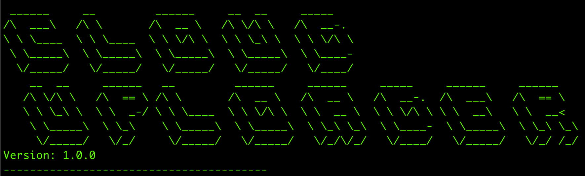
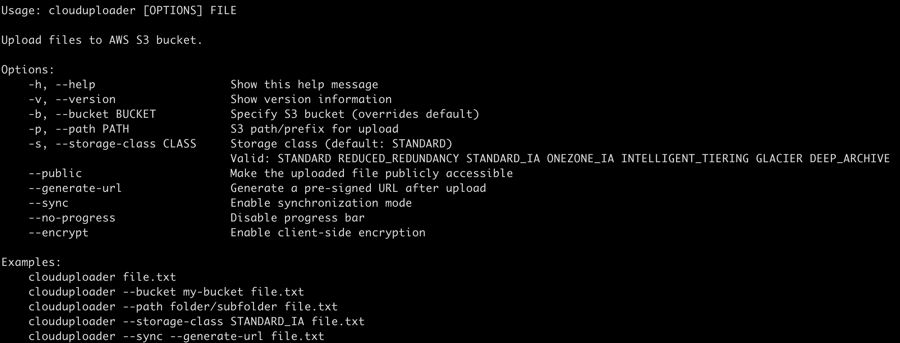

# CloudUploaderCLI



A powerful bash-based CLI tool for uploading files to AWS S3, providing a seamless upload experience with advanced features.

## Features

- 📤 Quick file uploads to AWS S3
- 🔒 Secure authentication using AWS IAM
- 📊 Progress bar for upload tracking
- 🔐 Server-side and client-side encryption support
- 🔄 File synchronization with conflict resolution
- 🌍 Pre-signed URL generation for file sharing
- 📦 Multiple storage class support
- ⚡ Easy to use command-line interface
- 🖥️ Cross platform support (Windows, macOS, Linux)

## Prerequisites

### Windows
- Git Bash, Cygwin, or WSL (Windows Subsystem for Linux)
- AWS CLI installed via Windows installer
- Optional: Windows Terminal (for better experience)

### macOS
- Bash shell (version 4.0 or later)
- AWS CLI (`brew install awscli`)
- Optional: `pv` for progress bar (`brew install pv`)

### Linux
- Bash shell (version 4.0 or later)
- AWS CLI (distribution-specific installation)
  - Debian/Ubuntu: `sudo apt-get install awscli`
  - RHEL/CentOS: `sudo yum install awscli`
- Optional: `pv` for progress bar (use package manager)

## Installation

### Windows
1. Install Git Bash or WSL if not already installed
2. Clone the repository:
```bash
git clone https://github.com/yourusername/clouduploader-cli.git
cd clouduploader-cli
```
3. Run the installation script:
```bash
./install.sh
```
4. The script will:
   - Create necessary directories
   - Add the tool to your PATH
   - Create a Windows batch wrapper

### macOS/Linux
1. Clone the repository:
```bash
git clone https://github.com/yourusername/clouduploader-cli.git
cd clouduploader-cli
```
2. Run the installation script:
```bash
./install.sh
```
3. Configure AWS credentials:
```bash
cp config/.env.template .env
# Edit .env with your AWS credentials
```

## Usage

### Windows (Git Bash/WSL)
```bash
# Using bash
clouduploader file.txt

# Using batch wrapper (CMD)
clouduploader.bat file.txt
```

### macOS/Linux
```bash
clouduploader file.txt
```

### Common Options (All Platforms)



```bash
# Upload with custom bucket
clouduploader --bucket my-bucket file.txt

# Upload to specific path
clouduploader --path folder/subfolder file.txt

# Use different storage class
clouduploader --storage-class STANDARD_IA file.txt

# Enable synchronization
clouduploader --sync file.txt

# Generate shareable link
clouduploader --generate-url file.txt

# Make file public
clouduploader --public file.txt

# Enable encryption
clouduploader --encrypt file.txt
```

## Platform-Specific Notes

### Windows
- File paths can use either forward (/) or backward (\\) slashes
- Progress bar functionality is limited
- Uses %APPDATA% for configuration storage
- Environment variables are stored in Windows registry

### macOS
- Full progress bar support with `pv`
- Configuration stored in ~/Library/Application Support
- Native terminal support

### Linux
- Full progress bar support with `pv`
- Configuration stored in ~/.config
- Native terminal support

## Storage Classes

Available storage classes:
- STANDARD (default)
- REDUCED_REDUNDANCY
- STANDARD_IA
- ONEZONE_IA
- INTELLIGENT_TIERING
- GLACIER
- DEEP_ARCHIVE

## Security

- HTTPS enforced for all operations
- Server-side encryption enabled by default
- Optional client-side encryption
- IAM roles and policies for access control
- Credentials stored securely in .env file

## Troubleshooting

### Windows-Specific Issues
1. **Path Issues**
   - Use forward slashes (/) in paths
   - Avoid spaces in file paths
   - Use full paths when in doubt

2. **Permission Errors**
   - Run Git Bash as Administrator
   - Check Windows Defender settings
   - Verify file permissions

3. **AWS CLI Issues**
   - Ensure AWS CLI is in PATH
   - Configure AWS credentials via `aws configure`
   - Check Windows credential manager

### macOS/Linux Issues
1. **Access Denied**
   - Check AWS credentials in .env
   - Verify IAM permissions
   - Ensure bucket name is correct

2. **Upload Failed**
   - Check internet connection
   - Verify file permissions
   - Check available disk space

3. **Progress Bar Not Showing**
   - Install pv: `brew install pv` (macOS)
   - Install pv: `apt-get install pv` (Debian/Ubuntu)
   - Use --no-progress to disable

## Uninstallation

### Windows
```bash
# Run from Git Bash
./uninstall.sh
```

### macOS/Linux
```bash
sudo ./uninstall.sh
```

## Acknowledgments

- Inspired by @learn-to-cloud guide
- Thanks to @madebygps and @rishabkumar7
- AWS CLI documentation
